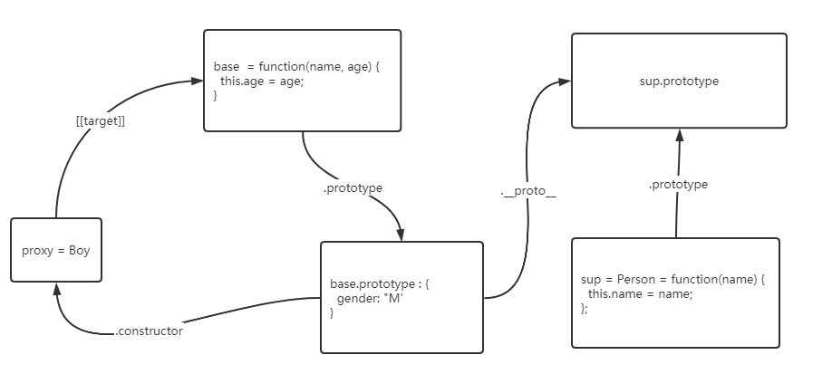
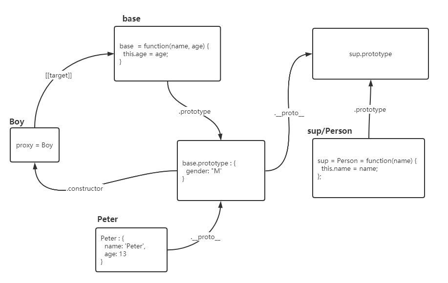

文档：[Proxy](https://developer.mozilla.org/en-US/docs/Web/JavaScript/Reference/Global_Objects/Proxy)  
基本使用就不赘述，看文档即可  

## 通用  
1.Proxy可以包装任何形式的对象：包括原生数组，函数，甚至另一个代理  
2.代理实例中没有指定的handler,实际就是操作原对象target：[实例：打开控制台查看](http://jsrun.net/3RLKp/edit)  
``` 
let target = function(){return 'ddd'}
let proxy = new Proxy(target, {});
proxy.prototype.age = 12
console.log(proxy.prototype === target.prototype) // true
```
3.代理实例只是返回对象target的一个代理包装(只有在触发handler时，handler中可以操作target)，target的更改不会触发代理实例的handler：[实例：打开控制台查看](http://jsrun.net/7BLKp/edit)  
  
MDN上有一个实例比较特别【拓展构造函数】，来看一下  
``` 
function extend(sup, base) {
  var descriptor = Object.getOwnPropertyDescriptor(
    base.prototype, 'constructor'
  );
  base.prototype = Object.create(sup.prototype);
  var handler = {
    construct: function(target, args) {
      var obj = Object.create(base.prototype);
      this.apply(target, obj, args);
      return obj;
    },
    apply: function(target, that, args) {
      sup.apply(that, args);
      base.apply(that, args);
    }
  };
  var proxy = new Proxy(base, handler);
  descriptor.value = proxy;
  Object.defineProperty(base.prototype, 'constructor', descriptor);
  return proxy;
}

var Person = function(name) {
  this.name = name;
};

var Boy = extend(Person, function(name, age) {
  this.age = age;
});

Boy.prototype.gender = 'M';

var Peter = new Boy('Peter', 13);

console.log(Peter.gender);  // "M"
console.log(Peter.name);    // "Peter"
console.log(Peter.age);     // 13
```
执行完Boy.prototype.gender = 'M'后，数据结构是下面这个样子的   

执行 var Peter = new Boy('Peter', 13);  
new操作进入到handler.construct，里面的上下文环境this即handler。直接调用this.apply进入handler.apply执行。new操作执行完毕之后的数据结构  
   
巧妙利用原型链和代理     
 


### handler形参中的receiver  
receiver是代理或继承代理的对象。通俗来讲，就是触发了handler的源头对象。一般receiver即是target的代理实例。  
但是如果对象继承了代理对象的情况，如下: [在线例子](http://jsrun.net/cRLKp/edit)   
``` 
"use strict"
const proxy = new Proxy({}, {
    get: function(target, prop, receiver) {
        if(proxy === receiver){
            console.log('receiver为proxy')
        }
        else if(obj === receiver){
            console.log('receiver为obj')
        }else{
            console.log('receiver不为proxy也不为obj')
        }
        return 'chua';
    }
});
proxy.dd // receiver为proxy
let obj = Object.create(proxy);
obj.msg // receiver为obj
```
proxy对象是obj对象的原型，obj对象本身并没有msg属性，所以根据原型链，会在proxy对象上读取该属性，导致被拦截。   
obj是obj.msg触发handler的原始调用（源头）
  
## handler.set

### set必须返回一个boolean类型  
必须返回一个boolean类型，true表示设置成功，返回false表示失败，严格模式下会抛错(下面的例子全部在严格模式下执行)  
**注意：**返回的数据如果不是boolean类型，会转换成布尔类型，假值包括：<font color="red">undefined，null，false, +0, -0, NaN, "" </font> [实例](http://jsrun.net/nRLKp/edit)       
``` 
const target = {
  msg: "hello"
};

const handler = {
    set: function(target, prop, value, receiver){
        target[prop] = value
        // return true
    }
};

const proxy = new Proxy(target, handler);
proxy.msg = 'wow' // Uncaught TypeError: 'set' on proxy: trap returned falsish for property 'msg'
```
handler.set在一下情况会抛错  
1.如果相应的目标对象属性是不可写的数据属性，则无法将属性的值更改为与相应目标对象属性的值不同的值。[实例:严格模式](http://jsrun.net/tRLKp/edit)
```
var obj = {}
Object.defineProperty(obj, 'year', { 
    // configurable: false, 默认false
    // writable: false, 默认false
    value: 2
})
Object.defineProperty(obj, 'class', { 
    configurable: true, 
    // writable: false, 默认false
    value: 'chua'
})
var proxy = new Proxy(obj, {
    set(target, prop, val){
        target[prop] = val
        return true
    }
})
proxy.card = 'sdf' // 设置成功
proxy.year = 10 // Uncaught TypeError: Cannot assign to read only property 'year' of object 
proxy.class = 'dd' // Uncaught TypeError: Cannot assign to read only property 'class' of object
```
2.如果相应的目标对象属性配置了[[Set]]为undefined，[实例](http://jsrun.net/GRLKp/edit)  
``` 
var obj = {}
const defineReactive =  function(data, key, val) {
    Object.defineProperty(data, key, {
        get: function(){
            return val
        },
        set: undefined // 应该设置成下面这个正确的函数
        // function(newVal) {
        //     val = newVal;
        // }
    });
}
defineReactive(obj, 'year', obj.year)
var proxy = new Proxy(obj, {
    set(target, prop, val){
        target[prop] = val
        return true
    }
})
obj.year = 20 // Uncaught TypeError: Cannot set property year of #<Object> which has only a getter
proxy.year = 30 // Uncaught TypeError: Cannot set property year of #<Object> which has only a getter
```
3.在严格模式下，handler.set错误返回值(转换为boolean后为false)将引发TypeError异常。

  
### 复杂对象 
Proxy只对其根属性（原型链上的也算）的值的更改做监听，如果某个属性key对应的值为一个引用类型，引用地址没有发生改变则不会进入到handler.set  
``` 
const target = {
    info: {
        name: 'chua',
        age: 18
    }
};

const handler = {
    set: function(target, prop, value, receiver){
        console.log('in handler.set', target, prop, value, receiver)
        target[prop] = value
        return true
    }
};

const proxy = new Proxy(target, handler);
proxy.info.name = 'chua1989' // 没有进入handler.set, 需要直接更改info属性才行
console.log(proxy.info.name) // chua1989
```  


### 参考：  
[MDN: Proxy](https://developer.mozilla.org/zh-CN/docs/Web/JavaScript/Reference/Global_Objects/Proxy)  
[阮一峰：ECMAScript 6 入门：Proxy](https://es6.ruanyifeng.com/#docs/proxy)，里面有些例子很有意思    
