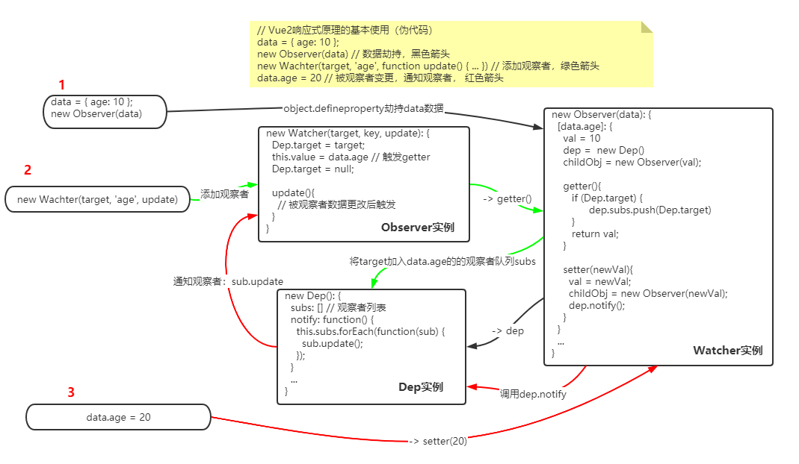
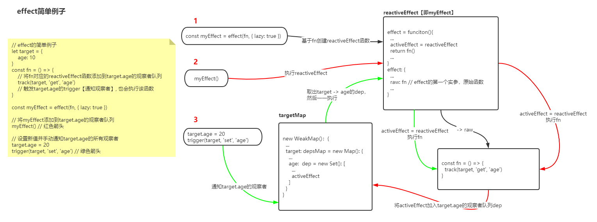

# 响应式原理
源码目录：https://github.com/vuejs/vue-next/tree/master/packages/reactivity  

## 模块
ref：   
reactive：  
computed：  
effect：  
operations：提供TrackOpTypes和TriggerOpTypes两个枚举类型，供其他模块使用

## 剖析

### Vue2响应式原理
什么是响应式数据？即A依赖于B数据，当B值发生变化时，通知A。很显然，这里应该使用观察者模式    
在vue2中的响应式原理：[剖析Vue原理&实现双向绑定MVVM](https://www.cnblogs.com/chuaWeb/articles/13554465.html)  
上面的文章将整个Vue的大致实现都分析了，就响应式这块来说，大概的逻辑是这几个模块Observer，Watcher，Dep。  
Observer负责通过defineProperty劫持数据Data，每个被劫持的Data都各自在闭包中维护一个Dep的实例，用于收集依赖着它的Watcher【即观察者】（都实现了一个update方法），被收集的Watcher存入Dep实例的subs数组中。如果Data是对象，则递归搜集。  
Dep维护一个公共的Target属性，在触发劫持前，将Target设置为当前Watcher, 然后触发getter将Target（Watcher）收集到subs中。然后再将Target置为null  
Data数据变更的时候触发setter,然后从Data维护的Dep实例的subs数组中将Watcher取出来一一执行其update方法。如果变更的值是对象，再劫持之。  
用一个最简单的伪代码来说明（省略掉了对值是复杂数据的处理，原理是一样的）  
``` 
// Vue2响应式原理的基本使用（伪代码）
data = { age: 10 };
new Observer(data) // 数据劫持，黑色箭头
new Wachter(target, 'age', function update() { ... }) // 添加观察者，绿色箭头
data.age = 20 // 被观察者变更，通知观察者， 红色箭头
```
对应的数据流程如下  
  

就上面的过程，实际上还是有比较大的问题  
1.如果Watcher使用的Data是对象类型，那么Data中所有的子属性都需要递归将Watcher收集，这是个资源浪费。  
2.数据劫持和依赖收集是强耦合关系  
3.对数组的劫持也没有做好，部分操作不是响应式的。  


### effect.ts  
用来生成/处理/追踪reactiveEffect数据，主要是收集数据依赖（观察者），通知收集的依赖（观察者）。  
提供了三个函数主要函数：effect/track/trigger。  
effect是将传入的函数转化为reactiveEffect格式的函数    
track主要功能是将reactiveEffect添加为target[key]的观察者   
trigger主要功能是通知target[key]的观察者（将观察者队列函数一一取出来执行）  
  
**effect(fn, options):ReactiveEffect**   
返回一个effect数据：reactiveEffect函数。  
执行reactiveEffect即可将数据加入可追踪队列effectStack，并将当前数据设置为activeEffect，并执行fn，fn执行完毕之后恢复activeEffect。  
【注意】：必须要在fn函数中执行track才能将reactiveEffect添加为target[key]的观察者，因为track内部只会处理当前的activeEffect，activeEffect没有值则直接返回 
  
   
**track(target, type, key)**  
将activeEffect添加为target[key]的观察者，如果activeEffect无值，则直接返回。target[key]数据被缓存到targetMap中以{target-> key-> dep}格式存储，优化内存开销。  
当前activeEffect（在调用reactiveEffect函数时会将reactiveEffect设置为activeEffect）添加为target[key]的观察者，被添加到target[key]的观察者队列dep中【dep.add(activeEffect)】   
当前target[key]的观察者队列dep也会被activeEffect收集【activeEffect.deps.push(dep)】  
     
**trigger(target, type, key, newValue, oldValue, oldTarget)**      
通知target[key]的观察者，即target-> key-> dep中存放的数据，全部一一取出来执行
如果观察者有提供scheduler则执行scheduler函数，否则执行观察者（函数类型）本身    
   
  
流程是：  
首先要将某个函数fn包裹一层为reactiveEffect函数。  
当执行reactiveEffect函数时内部会将当前reactiveEffect函数标记为activeEffect，然后执行fn。  
fn内部可以调用**track**,将activeEffect添加为target[key]的观察者，加入队列dep中。当然activeEffect也收集了target[key]的观察者队列dep。   
这时，如果修改target[key]的值，然后调用**trigger**，触发通知target[key]的观察者。trigger中会将对应的观察者队列中的观察者一一取出执行。   
``` 
import { effect, track, trigger } from 'vue'
let target = {
    age: 10
}
const fn = () => {
    // 将fn对应的reactiveEffect函数添加到target.age的观察者队列
    track(target, 'get', 'age')
    // 触发target.age的trigger【通知观察者】, 也会执行该函数
}
// 将fn函数包裹一层为reactiveEffect函数
const myEffect = effect(fn, { lazy: true })
// myEffect每次执行都会将自己设置为activeEffect，并执行fn函数
// fn内部会将对应的reactiveEffect函数添加到target.age的观察者队列
myEffect()
// 设置新值并手动通知target.age的所有观察者
target.age = 20
// 通知target.age的观察者
trigger(target, 'set', 'age')
``` 
结合流程说明看这段代码，数据流图
  
  
理论上来说，将reactiveEffect添加为target[key]的观察者不一定要在fn中进行。但不这样，用户需要手动为target[key]指定观察者，形如  
```
activeEffect = reactiveEffect
track(target, 'get', 'age') // 内部会将activeEffect添加为target.age的观察者
activeEffect = null
```
为了简化处理，reactiveEffect内部处理为    
```
// reactiveEffect 内部
try {
    effectStack.push(effect)
    // 当前effect设置为activeEffect
    // 第一次track被调用时，该effect会被加入effectStack
    activeEffect = effect
    // 执行fn的过程中会对activeEffect做处理
    return fn()
} finally {
    effectStack.pop()
    activeEffect = effectStack[effectStack.length - 1]
} 
```
在fn执行之前已经将reactiveEffect设置为activeEffect，并且fn执行完毕之后会恢复activeEffect，  
这样fn中只需要调用一下track,就将fn对应的reactiveEffect添加为target.age的观察者了,代码如下    
``` 
// fn
const fn = () => {
    ...
    track(target, 'get', 'age')
    return get.age
}
```
  
我们将最开始的那个例子改造成一个更加真实的的例子
``` 
import { effect, track, trigger } from 'vue'
let target = {
    _age: 10,
    set age(val) {
        this._age = val
        trigger(this, 'set', 'age')
    }
}
const watcher = () => {
    console.log('target.age有更改，则通知我')
}
const fn = () => {
    if(!target._isTracked){
        target._isTracked = true
        track(target, 'get', 'age')
        console.log('添加fn的reactiveEffect函数添加到target.age的观察者队列')
    }else{
        watcher()
    }
}
fn._isTracked = false

const myEffect = effect(fn, { lazy: true })
myEffect() //打印： '添加fn的reactiveEffect函数添加到target.age的观察者队列'
target.age = 20 //打印： '触发target.age的trigger【通知观察者】, 进入此处'
```  
  
